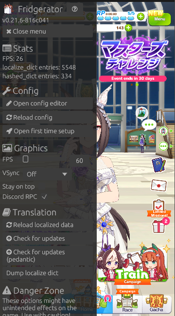

  

<h1 align="center">Fridgerator</h1>

  <strong>Game enhancement and translation framework for UM:PD</strong>

  <strong>[NO DISCORD SERVER LINK FOR YOU]</strong>

---

Fridgerator is a cross-platform modding tool designed to provide high-quality localized experiences and technical enhancements. It allows you to enjoy the game with custom translations, improved graphics, and a modern set of features—all integrated seamlessly.

  

> [!WARNING]
> This project is a community-driven effort and is not affiliated with or endorsed by the original game developers. Using mods may violate the game's **Terms of Use & Copyrights**. Please refrain from sharing links to this repository on public forums or official game channels.

## ✨ Features

- **🎯 High-Quality Localizations**  
  Advanced translation engine supporting plural forms, ordinal numbers, and complex UI components. No manual asset patching required—everything is handled on-the-fly.
    - UI text & master.mdb support
    - Story & Lyrics translation
    - Texture & Sprite atlas replacement

- **🔄 Seamless Updates**  
  Built-in auto-updater for translations. Update your data while playing and see the changes immediately without restarting the game.

- **🛠️ Built-in GUI**  
  Fully integrated in-game configuration editor. Adjust every aspect of your experience without leaving the game window.

- **🚀 Technical Enhancements**
    - **Graphics:** Unlock FPS, adjust resolution scaling, and tune MSAA settings.
    - **Gameplay:** Story choice auto-selection, dynamic camera controls, and more.
    - **Discord RPC:** Share your activity with friends automatically.

- **📱 Cross-Platform**  
  Optimized for both **Windows** and **Android**, providing a consistent experience across all your devices.

## 📦 Installation

Ready to get started? Visit our documentation for detailed setup instructions:

👉 **[Getting Started Guide (Temporary)](https://hachimi.noccu.art/docs/hachimi/getting-started.html)**

## 🤝 Acknowledgments

Fridgerator stands on the shoulders of giants. Special thanks to the following projects:

- [Trainers' Legend G](https://github.com/MinamiChiwa/Trainers-Legend-G)
- [umamusume-localify-android](https://github.com/Kimjio/umamusume-localify-android)
- [umamusume-localify](https://github.com/GEEKiDoS/umamusume-localify)
- [Carotenify](https://github.com/KevinVG207/Uma-Carotenify)
- [umamusu-translate](https://github.com/noccu/umamusu-translate)
- [frida-il2cpp-bridge](https://github.com/vfsfitvnm/frida-il2cpp-bridge)

## 📄 License

This project is licensed under the [GNU GPLv3](LICENSE).
